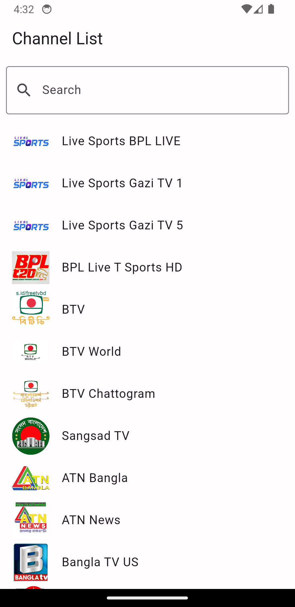
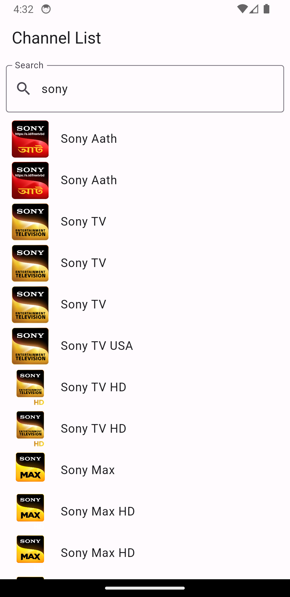

# IPTV

Watch 500+ live india TV channels with IPTV **Android Application**

[**Download Latest APK From Release**](https://github.com/kananinirav/iptv-indian-app/releases/)

## Feature

- 500+ live Tv Channels
- Search Channels
- Full Screen View

## Sample Image

  
  
  
  

**If you find this helpful, please give a star to this repository and share it with your friends. Your support is greatly appreciated!**

## Credits

[Channel Source](https://github.com/aniketda/iptv2050)

## Star History

## Contributors

Please Feel free to contribute by submitting a Pull Request!

### If you find this extension useful, consider supporting the project by using the "Buy me a Coffee" link below

